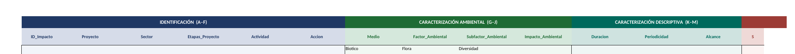
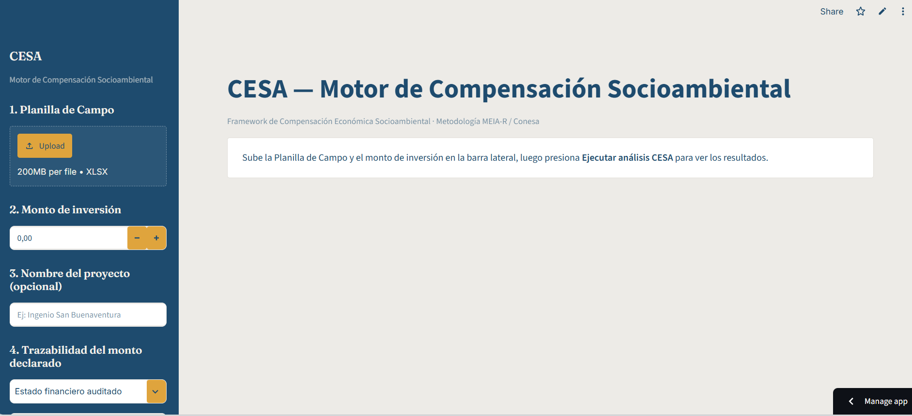
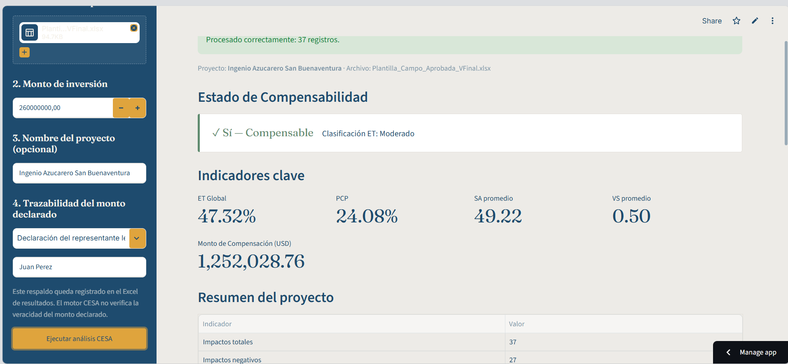
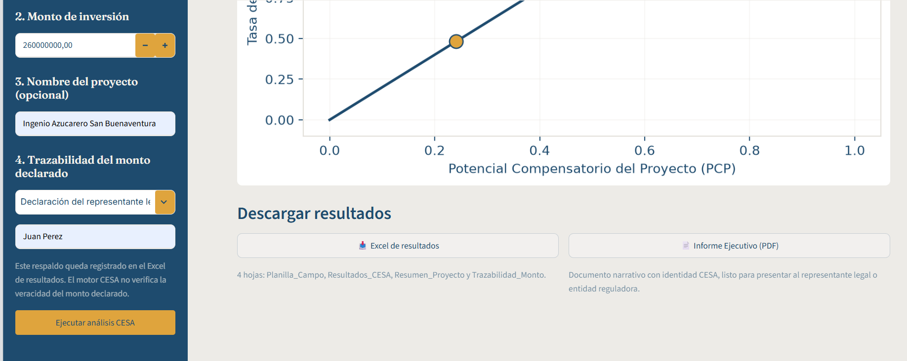
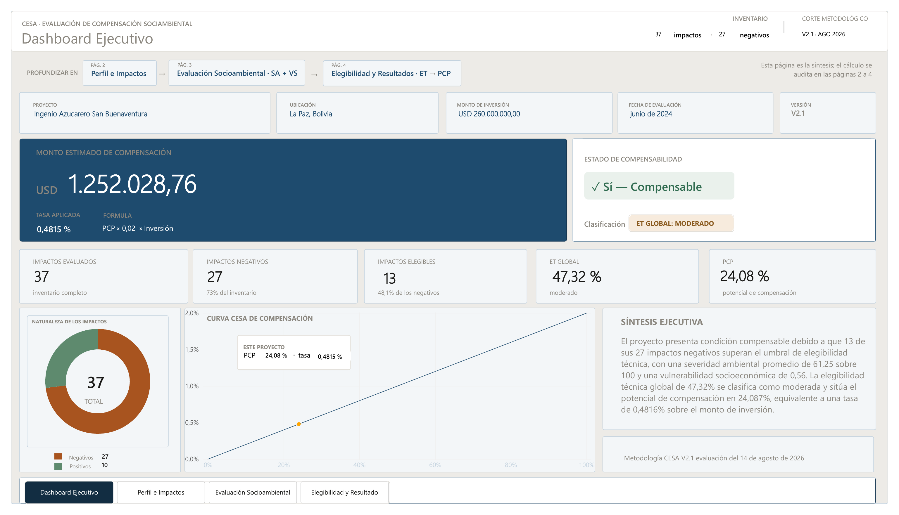
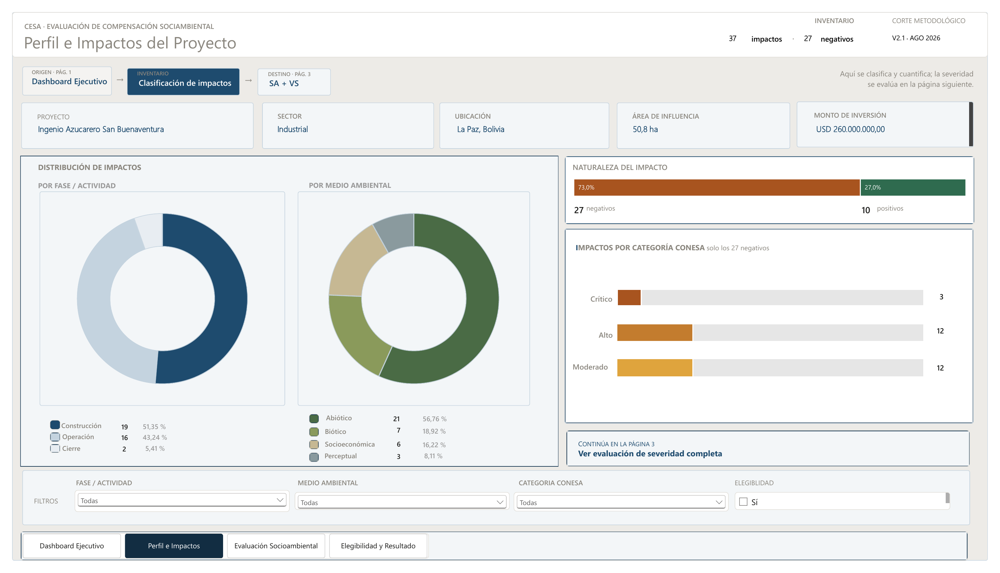
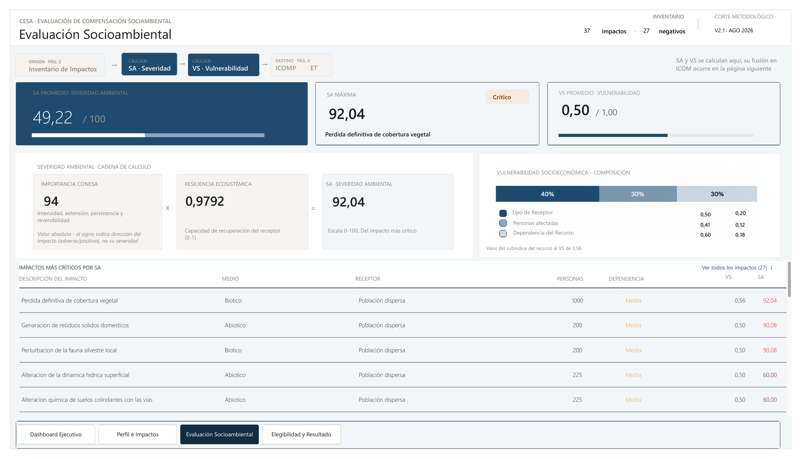
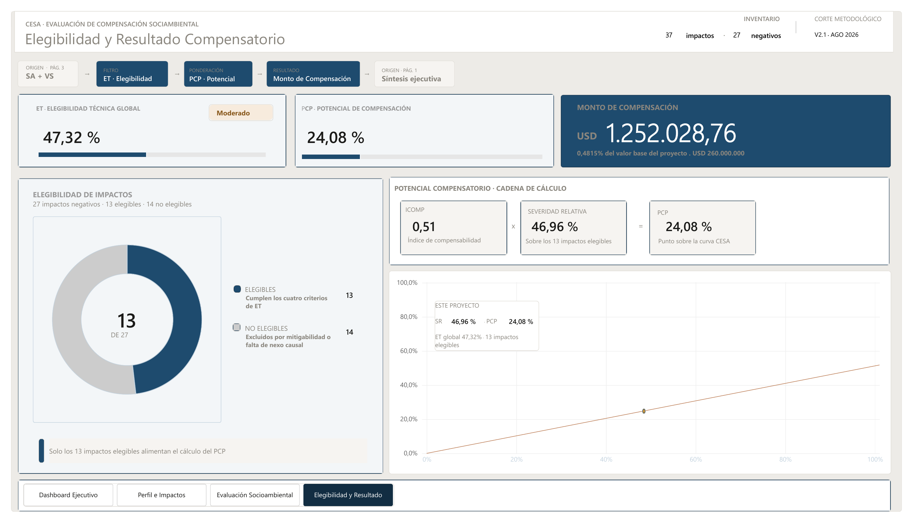

# CESA — Compensación Económica Socioambiental

**Framework propio para evaluar impactos ambientales y estimar la
compensación económica asociada**, desarrollado end-to-end: metodología,
motor analítico en Python, aplicación web en Streamlit y dashboard
ejecutivo en Power BI.

> 🔒 Este repositorio es una vitrina de portafolio. El código fuente y
> la metodología completa son propiedad intelectual del autor y no se
> publican aquí. Demo privada disponible bajo consulta.

## ¿Qué resuelve?

Cuando un proyecto (industrial, minero, agroindustrial, energético...)
genera impactos ambientales que no pueden mitigarse por completo, CESA
cuantifica técnicamente:

- **Qué tan severo** es el impacto sobre el ambiente (Severidad Ambiental)
- **Qué tan vulnerable** es la población o ecosistema receptor (Vulnerabilidad Socioambiental)
- **Si el impacto es técnicamente elegible** para compensación (Elegibilidad Técnica)
- **Cuál sería el monto de compensación económica** justo, acotado a un
  techo metodológico transparente y trazable hasta el dato de campo

## El ecosistema completo

```
Planilla de Campo (Excel)  →  Motor CESA (Python)  →  Streamlit (operación)
                                                    →  Power BI (análisis ejecutivo)
```

Una única Planilla de Campo, con estructura y validaciones
predefinidas, alimenta un motor de cálculo común. Ese motor es
consumido por dos productos distintos según la necesidad: una
aplicación web para ejecutar evaluaciones y descargar resultados, y un
dashboard ejecutivo para el análisis y la comunicación de hallazgos.

Los ejemplos de este documento corresponden a una evaluación real
(proyecto **Ingenio Azucarero San Buenaventura**), pero **la
herramienta es agnóstica del proyecto**: cualquier evaluación nueva
solo requiere completar la Planilla de Campo preestablecida,
compatible con el motor de procesamiento — sin tocar una sola línea
de código.

---

## 1. Planilla de Campo — el punto de partida

Estructura estandarizada por bloques (Identificación, Caracterización
Ambiental, Caracterización Descriptiva, Conesa, Resiliencia,
Elegibilidad, Economía Ambiental, Localización), con comentarios y
listas de validación en cada columna para que el evaluador de campo la
complete sin ambigüedad metodológica.



## 2. Aplicación web (Streamlit) — operación y resultados

**Carga de datos, monto de inversión y trazabilidad del respaldo
declarado:**



**Resultados de una evaluación real** — estado de compensabilidad,
indicadores clave y resumen del proyecto:



**Curva de compensación y exportación de resultados** — Excel de 4
hojas e Informe Ejecutivo en PDF, ambos generados dinámicamente:



## 3. Dashboard Ejecutivo (Power BI) — análisis y comunicación

Mismo motor, misma fuente de verdad metodológica — presentada ahora
para análisis exploratorio y storytelling ejecutivo.

**Síntesis ejecutiva:**


**Perfil del proyecto y distribución de impactos:**


**Severidad Ambiental y Vulnerabilidad Socioambiental:**


**Elegibilidad técnica y resultado compensatorio:**


---

## Ejemplo de resultados reales

Corrida sobre el proyecto **Ingenio Azucarero San Buenaventura** (37
impactos evaluados, monto de inversión de referencia USD 260,000,000):

| Indicador | Resultado |
|---|---|
| Impactos evaluados | 37 (27 negativos, 13 técnicamente elegibles) |
| Estado de compensabilidad | Sí — Compensable |
| ET Global | 47.32% (Moderado) |
| PCP (Potencial Compensatorio del Proyecto) | 24.08% |
| Monto de compensación estimado | USD 1,252,028.76 |

## Metodología

Basado en la metodología de **Conesa** (Importancia del Impacto)
corregida mediante **MEIA-R** (Resiliencia Ecosistémica), con un
modelo de Vulnerabilidad Socioambiental de tres componentes
ponderados y un filtro secuencial de Elegibilidad Técnica. El monto de
inversión del proyecto se declara al ejecutar el análisis y nunca
forma parte de la Planilla de Campo, preservando la independencia del
criterio técnico del evaluador ambiental respecto a la cifra
económica.

## Stack tecnológico

- **Python** — motor de cálculo (única fuente de verdad metodológica)
- **Streamlit** — aplicación web interactiva, desplegada en producción
- **ReportLab** — generación dinámica de informes ejecutivos en PDF
- **Power BI** — dashboard ejecutivo de análisis e indicadores
- **Claude Design** — prototipado de alta fidelidad de la interfaz
- **Git / GitHub** — control de versiones, repositorio privado para el
  código fuente

## Funcionalidades del producto

- Carga de datos de campo y validación automática antes de calcular
  cualquier índice
- Trazabilidad completa del monto de inversión declarado (fuente,
  responsable, fecha)
- Historial de corridas dentro de una misma sesión, para comparar
  escenarios o proyectos
- Exportación a Excel (4 hojas) e Informe Ejecutivo en PDF, ambos
  generados dinámicamente a partir del resultado real de cada corrida
- Identidad visual propia, consistente entre la app y el dashboard de
  Power BI

## Autor

**Víctor Hugo Villegas Ríos**
Ingeniero Agrónomo Especialista en Medio Ambiente y RR NN · Consultor en Ciencia de Datos y BI aplicados a
Gestión Ambiental

- [GitHub](https://github.com/VictorHugoVillegasRios)
- [LinkedIn](https://www.linkedin.com/in/victorhugovillegasrios/)
- [Facebook: Data Analytics & Intelligence](https://www.facebook.com/DataAnalyticsIntelligence)
- Contacto: [victorhvillegasr@gmail.com](mailto:victorhvillegasr@gmail.com)